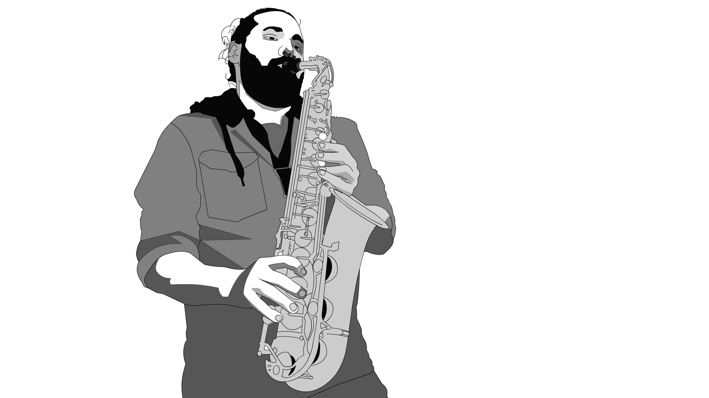

Bienvenidos a la presentación de 
# Agustín Alabarces Varela

Agustín es estudiante de la Tecnicatura en Programación de Videojuegos en la Universidad Nacional de Hurlingham. También es saxofonista, compositor, diseñador de juegos y programador. Vive en la Ciudad de Buenos Aires y desde el 2024 trabaja en ADE Solutions creando experiencias interactivas.

El cuatrimestre pasado quiso cursar Programación con Objetos 1 como oyente, pero no tener contacto con sus compañeres le dificultó la cursada, así que espera tener una experiencia más placentera y enriquecedora este cuatrimestre.

Podés escuchar algunas de las bandas sonoras para videojuegos que compuso <a href='https://www.youtube.com/watch?v=N2alAElgwOg&list=PLBSTAw-qp1EX5QRS2a5wufFMdRhWZTtpV'>acá</a> o a su orquesta de salsa, la Vértigo López, <a href='https://www.youtube.com/watch?v=p4RVv-KQDSg'>acá</a>. Podés jugar a sus juegos <a href='https://aalabarces.github.io/'>acá</a>.

Siempre está abierto a recibir <a href='mailto:aalabarces@gmail.com'>un mail</a> sobre cualquier tema.
